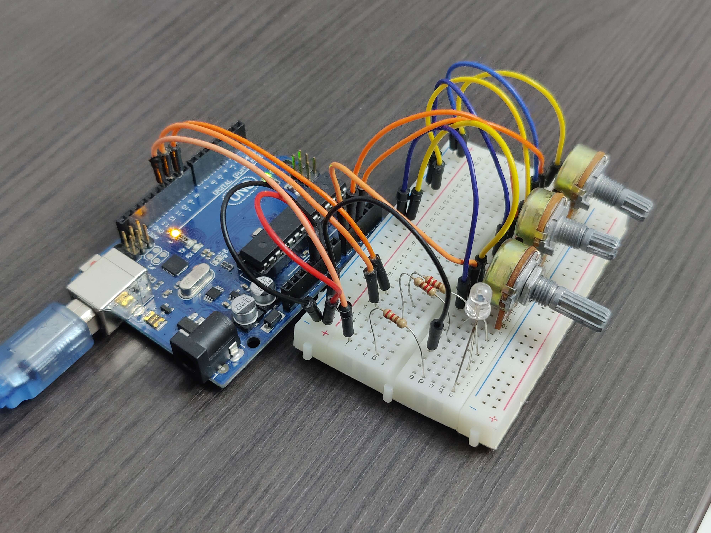

# Introduction To Robotics

## Homework #0
#### Setting up this repository :eyes: and installing Arduino IDE.

## Homework #1
#### Use 3 potentiometers to digitally control a RGB led💡. Each one should control one of the color of the RGB led (Red, Green and Blue).

 

  <h3>
    <a href="https://youtu.be/iI-4w1YR5sA">
      ▶️ Click here for video
    </a>
  </h3>

 

## Homework #2
