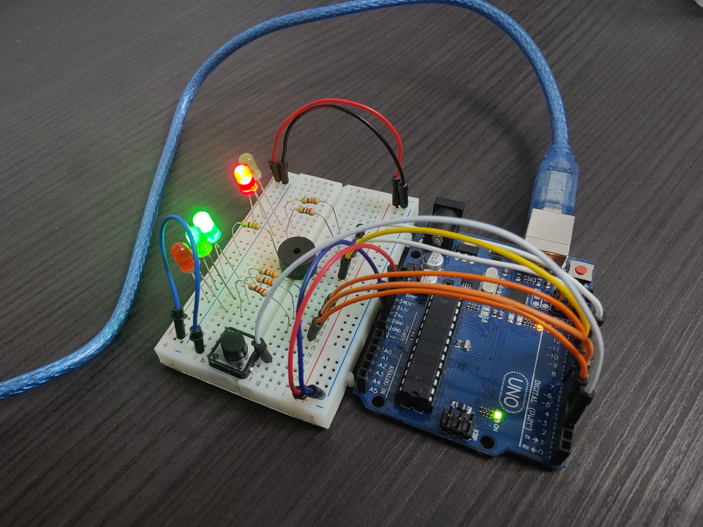
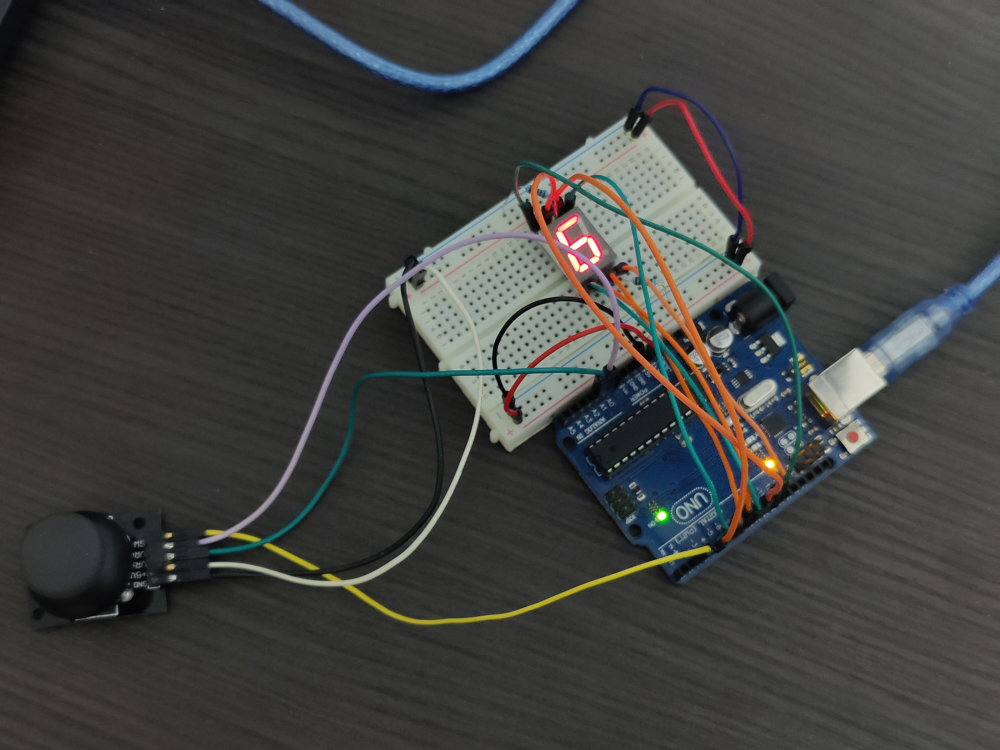
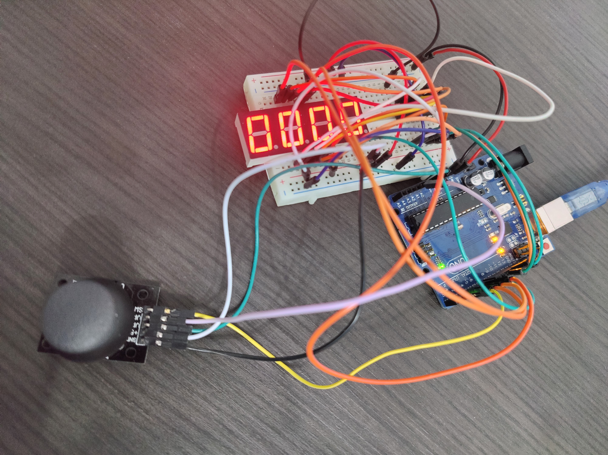

# Introduction To Robotics

## Homework #0
#### Setting up this repository :eyes: and installing Arduino IDE.

## Homework #1
#### Use 3 potentiometers to digitally control a RGB led💡. Each one should control one of the color of the RGB led (Red, Green and Blue).

 

  <h3>
    <a href="https://youtu.be/iI-4w1YR5sA">
      ▶️ Click here for video
    </a>
  </h3>

 

## Homework #2
#### Build the traffic lights for a crosswalk 🚥. It should have 4 states:
  - *State 1*: Cars crossing (green for cars, red for pedestrians) -> Duration: indefinite, changed by pressing the button. 
  - *State 2*: Cars stopping (yellow for cars, red for pedestrians) -> Duration: 3s.
  - *State 3*: Pedestrians crossing (red for cars, green & beeping sound for pedestrians) -> Duration: 8s.
  - *State 4*: Last seconds for pedestrians crossing (red for cars, blinking green & faster beeping sound) -> Duration: 4s. GO TO State 1.

 

  <h3>
    <a href="https://youtu.be/_XeAA2KXuXo">
      ▶️ Click here for video
    </a>
  </h3>

 

## Homework #3
#### Draw on a 7-segment display using a joystick 🕹️. It should have 2 states:
  - *State 1*: Current position blinking. Can use the joystick to move from one position to neighbors.   
    - **Short pressing** the button toggles state 2.  
    - **Long pressing** the button in state 1 resets the entire display.
  - *State 2*: The current segment stops blinking, adopting the state of the segment before selection. With joystick axis, led can be toggled ON/OFF.

 

  <h3>
    <a href="https://youtu.be/qW21jHZT9xs">
      ▶️ Click here for video
    </a>
  </h3>

 

## Homework #4

#### Controlling a 4 digit 7-segment display using a joystick 🕹️. It should have 2 states:
  - *State 1*: Use the joystick axis to cycle through the 4 digits. A blinking decimal point showsthe current digit position. 
    - **Short pressing** the button, current segment locked in & toggled state 2.  
    - **Long pressing** the button in state 1 resets the entire display.
  - *State 2*: the decimal point stays always on. With joystick axis, you can increment or decrement the number on the current  digit IN HEX.

 

  <h3>
    <a href="https://youtu.be/mZiB5XQWV4E">
      ▶️ Click here for video
    </a>
  </h3>

 

